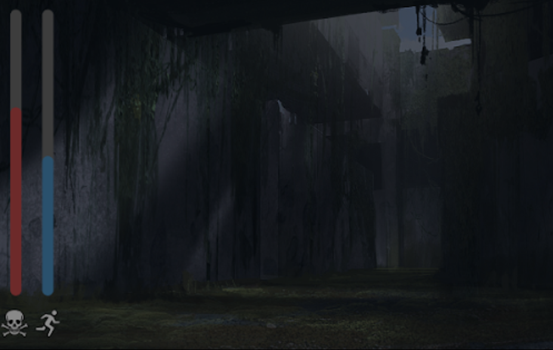

# Game Design Document - Repentance

## 1. Game Overview

### 1.1 Concept
Repentance is a single-player survival game. Trapped in a maze with vengeful monsters that were once victims of the player’s family, the player’s primary objective is to stay alive for 5 minutes. At the same time, the player’s role is to confront their family’s dark past and make decisions that could shape their own fate.

### 1.2 Genre
Repentance is a survival horror game. The player is challenged to survive for 5 minutes while trapped in the maze by either hiding or running from the monsters. The game sets up suspense by making use of horror game elements such as spine-chilling graphics, dark environments, unexpected attacks and eerie sound effects.

    

[Horror Sound Effect](./Audio/horror-sound-effect.mp3)

[Monster Growl](./Audio/monster-growl.mp3)

### 1.3 Target Audience
Set in a maze with horror elements, the game is targeted at players who are drawn to experiencing thrill in a controlled environment. Additionally, the 5-minute time constraint on the game makes it suitable for players who prefer or can only afford to play in short bursts.

### 1.4 Unique Selling Points

#### 1.4.1 Compelling Storyline
Repentance follows a storyline that progressively unfolds as the game scales in difficulty. The player’s role is not only to survive, but also to uncover the gruesome truth about his / her family and face the consequences of their past actions. The intertwining of survival and story progression creates an immersive experience that keeps players emotionally engaged.

#### 1.4.2 Appealing Aesthetic
Inspired by the dystopian science fiction film ‘Maze Runner’ (left), the game features a pixelated maze-like environment where the walls are overgrown with foliage (right). The pixelated graphics style creates a nostalgic retro feel while the foliage, just as it conceals the features of the maze, symbolizes the hidden secrets and dangers that lurk in the player’s world.

    
    

#### 1.4.3 Unique Mechanics
Other than the standard player health, Repentance includes player stamina as a gameplay mechanic that reflects a realistic physical limitation of the player’s character and heightens the challenge of the game. Stamina will allow the player to walk or run away from the monsters, with running incurring a faster depletion of stamina. Stamina can be gained if the player rests or collects certain items scattered around the maze. Having to balance multiple resources adds depth to the gameplay and encourages the player to think strategically.

    

## 2. Story and Narrative

### 2.1 Backstory

Our playable character by some stroke of misfortune has found themselves in front of a strange structure or could be a set of buildings? They ponder the thought, as towering walls of broken stone filled with dilapidated foliage surround them. They move deeper into the maze lost in thoughts of confusion and regret.

- The main character had received a letter detailed in their parents will, this was to be delivered to them upon their mother/father’s passing
- The letter described a location containing a family heirloom 
- The location was said to be the old location of the family home, found deep within the countryside
- The town supposedly no longer exists, but the letter states otherwise and insists that heirloom still resides there. 
- The player tracks the location confused as to why their parents desperately insisted that they obtain the heirloom 
- The location can be described as a desolate town, however the deeper they walk into the town they face large towering walls and an entrance to what appears to be a labyrinth

### 2.2 Additional Information / Story

- Your family has a dark history  
- As you go through the labyrinth you may come across information that pertains to what happened
- What crime was committed? (Murder / War crime / Other Heinous act) Who was responsible? (Family member/s/ Family with connections covers it up), Victims 
(1 - 3)
- The Heirloom is an old knife/ weapon
- How to atone for the past / What can the main character do?
- Appease the deceased (This can be set as a optional objective which you will have to read / actively search for)
- Bad ending (You just try and Survive) Good End (Appease the Victims)
- Should the present generation atone for the mistakes of the past

### 2.3 Characters

- Main Character  : Brave but clueless, they understand that the heirloom is of great importance, they also hold great curiosity towards the strange location as well as towards the heirloom.
- Monsters / Ghosts / ??? / Entity : There can be one entity or many differing entities, these may represent the victims.

## 3. Game Mechanics

### 3.1 Player Perspective
First-person perspective where the player’s view is defined by the camera. The player is able to move the camera to create the impression that they are looking around the game. The player’s character is largely not visible on the screen. Only the arms will be seen to further enhance the impression of a first-person perspective.

    
    

#### 3.1.1 The player's arms

    
    

### 3.2 Controls

#### 3.2.1 Basic Controls
- W -> forward
- A -> left
- S -> backward
- D -> right
- Mouse -> camera

#### 3.2.2 Other 
- E -> interact with game objects
- shift + W/A/S/D -> sprint
- F -> flashlight

#### 3.3 Progression
The player becomes trapped within the maze when the game begins and they must survive 5 minutes until the sun rises in order to win.
The maze is broken into three main sections each containing different ghosts. Each ghost has a different attack style and the player must avoid these ghosts as one attack from any ghost will kill the player. 
Throughout the maze the player will find tombstobes that belong to the ghost. The player will have the opportunity to interact with the tombstone and destory it. Destroying a tombstone will reveal part of the game's backstory, however it will anger the ghost and make the game more difficult for the player. 

#### 3.4 Gameplay Mechanics
The player is able to walk (using WASD) or sprint (using WASD + shift). The sprint capability is limited by a stamina bar that is depleted and slowly refilled. Additionally, the player is able to use the F key to equip a flashlight in areas of the maze that are dark too dark for the player to be able to see in. The player will come across different artifacts throughout the maze that can be interacted with using the E key. These artifacts reveal parts of the story and are saved to a log.
The limitation of the sprint ability, along with the use of different light levels within the maze will make the game more challenging for the player.

## 4. Levels and World Design

### 4.1 Game World 

The world seen by the player is a maze with an aesthetic style inspired by the Maze Runner. It is 3D and will be displayed on a single screen. Only one level will be available, however, the maze will be randomly generated and change each time the game is played. This allows the game to be replayed multiple times. The player starts in the center of the maze and will have to navigate through the maze by exploring and running away from the ghosts in order to survive. Hints and helpful items may be available to the player if they find them in the maze, however, no map/minimap will be available as it would defeat the purpose of the maze. 

  

### 4.2 Objects 

- Tombstones. Players are given the option to destroy tombstones or interact with them in some way to unlock lore. 
- Heirloom. Looks like an old knife/ weapon. 
- Flashlight. Starts in the player’s inventory. Player can turn it on or off.
- The player can collect other items to affect gameplay.

  

### 4.3 Physics 

- Players will collide with the walls of the maze.
- Players will accelerate up to a certain speed when they sprint.
- Players will decelerate when they run out of stamina or stop sprinting.
- Players will collide with tombstones.
- Players will be able to run through the ghosts. 
- Walls can block projectiles thrown by the ghosts.

## 5. Art and Audio

### 5.1 Art Style  
- Retro Style, Playstation 1 Graphics
- Use of pixelated art
- Dark , sinister , uncomforting, Horrifying

    

Overall we intended on intentionally implementing lower quality graphics. As stylistically, this may allow additional details to be filled in by the player’s mind. In addition, lowering the quality may indicate some level of detachment from reality, in this case the intention is to further exacerbate the uncaniness of the situation, something that appears to be similar yet also different. Furthermore, the art style allows for the natural depiction of hard edges compared to smoothness that may commonly be associated with higher graphic quality. This reliance on hard edges in graphics may subconciously alert the player, keeping them uncomfortable and on edge.

     

### 5.2 Audio 

- Exudes a Sombre atmosphere
- Charcter Sounds : Footsteps , Flashlight, Breathing
- Music: Quiet / Simple Ambience, Builds up when progressing, Monster encounter is intense, dire, alarming.

### 5.3 Sound Design 

In terms of sound design, sounds should likewise feel lower in quality and granular texture. This is in order to complement the visual aspect of the game thematically. Sounds feel as if they’re passing through a radio. Sounds in the game such as footsteps, doors and breathing shouldn’t feel pleasant to the ear, but should feel deliberate and noticeable. Your actions in the game will take up valuable time and the sounds should reflect those actions.

### 5.4 Music 

The music is rather simplistic tonally, typically consisting of low tones. This may build into something more intense as the time progresses. Additionally, intense music may be included for when the monster has been encountered with the player or is engaged in pursuing the player.

Stylistic examples of intended Game music: 

[Roaming](https://drive.google.com/file/d/1O82vf_UDBbfn1ZsjR-IYGfpafnlD3qGV/view?usp=sharing) 

[Ambience](https://drive.google.com/file/d/1MfeCC1r3Ar_6i5UGtjAIfRbbe2XYq9dj/view?usp=sharing)

Credit: Resident Evil 7 Original Soundtrack composed by: 

Akiyuki  Morimoto, Satoshi Hori, Miwako Chinone, Brian D'Olivera, Cris Velasco.

Release: 2017

### 5.5 Assets 

In terms of utilising pre built assets, we hopefully aim to find them from the Unity Store, as a base line, this may include 3d models but edited over with custom textures in order to better suit the theme of our game.  

## 6. User Interface

### Start Screens

    
    

### In-Game Screens

    
    

