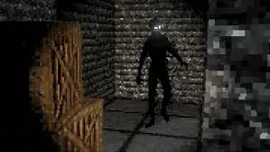
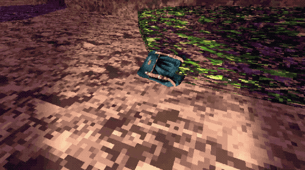

## Story and Narrative

- Backstory: What is the backstory of the game? What is the setting? What is the main conflict? If there is a story, how does it unfold as the player progresses through the game?
- Characters: Is the player the only character? Is there a villain or boss? Who are the main characters in the game? What are their backgrounds? What are their motivations? What are their relationships to each other? What are their goals? What are their personalities? What do they look like?

### Backstory

Our playable character by some stroke of misfortune has found themselves in front of a strange structure or could be a set of buildings? They ponder the thought, as towering walls of broken stone filled with dilapidated foliage surround them. They move deeper into the maze lost in thoughts of confusion and regret.

- The main character had received a letter detailed in their parents will, this was to be delivered to them upon their mother/father’s passing
- The letter described a location containing a family heirloom 
- The location was said to be the old location of the family home, found deep within the countryside
- The town supposedly no longer exists, but the letter states otherwise and insists that heirloom still resides there. 
- The player tracks the location confused as to why their parents desperately insisted that they obtain the heirloom 
- The location can be described as a desolate town, however the deeper they walk into the town they face large towering walls and an entrance to what appears to be a labyrinth

### Additional Information / Story

- Your family has a dark history  
- As you go through the labyrinth you may come across information that pertains to what happened
- What crime was committed? (Murder / War crime / Other Heinous act) Who was responsible? (Family member/s/ Family with connections covers it up), Victims 
(1 - 3)
- The Heirloom is an old knife/ weapon
- How to atone for the past / What can the main character do?
- Appease the deceased (This can be set as a optional objective which you will have to read / actively search for)
- Bad ending (You just try and Survive) Good End (Appease the Victims)
- Should the present generation atone for the mistakes of the past

### Characters

- Main Character  : Brave but clueless, they understand that the heirloom is of great importance, they also hold great curiosity towards the strange location as well as towards the heirloom.
- Monsters / Ghosts / ??? / Entity : There can be one entity or many differing entities, these may represent the victims.

## Art and Audio

- Art Style: What is the art style of the game? What does the game look like? What are the colours, shapes, and textures used? What is the overall aesthetic? Concept art and/or references to games with similar art styles might be helpful here.
- Sound and Music: What is the sound design of the game? What sounds are used? What music is used? How do the sounds and music fit in with the overall aesthetic of the game?
- Assets: What "artistic" assets are going to be used in the game? How are you planning to create or source these assets? Provide a list of candidate assets (e.g., URLs) and their sources if you are sourcing them from the internet.

### Art Style  
- Retro Style, Playstation 1 Graphics
- Use of pixelated art
- Dark , sinister , uncomforting, Horrifying

    

Overall we intended on implementing with intentionally lower quality graphics. As stylistically, this may allow the player’s mind to fill in the gaps, in a sense lowering the quality likewise indicates somewhat of a detachment from reality, in this case the intention is to further exacerbate the uncaniness of the situation, something that appears to be similar yet also different. Additionally, the art style allows for the natural depiction of hard edges compared to smoothness that may commonly be associated with higher graphic quality. 

     

### Audio 

- Exudes a Sombre atmosphere
- Charcter Sounds : Footsteps , Flashlight, Breathing
- Music: Quiet / Simple Ambience, Builds up when progressing, Monster encounter is intense, dire, alarming.

### Sound Design 

In terms of sound design, sounds should likewise feel lower in quality and granular texture. This is in order to complement the visual aspect of the game thematically. Sounds feel as if they’re passing through a radio. Sounds in the game such as footsteps, doors and breathing shouldn’t feel pleasant to the ear, but should feel deliberate and noticeable. Your actions in the game will take up valuable time and the sounds should reflect those actions.

### Music 

The music is rather simplistic tonally, typically consisting of low tones. This may build into something more intense as the time progresses. Additionally, intense music may be included for when the monster has been encountered with the player or is engaged in pursuing the player.

Stylistic examples of intended Game music: 

[Roaming](https://drive.google.com/file/d/1O82vf_UDBbfn1ZsjR-IYGfpafnlD3qGV/view?usp=sharing) 

[Ambience](https://drive.google.com/file/d/1MfeCC1r3Ar_6i5UGtjAIfRbbe2XYq9dj/view?usp=sharing)

Credit: Resident Evil 7 Original Soundtrack composed by: 

Akiyuki  Morimoto, Satoshi Hori, Miwako Chinone, Brian D'Olivera, Cris Velasco.

Release: 2017

### Assets 

In terms of utilising pre built assets, we hopefully aim to find them from the Unity Store, as a base line, this may include 3d models but edited over with custom textures in order to better suit the theme of our game.  

