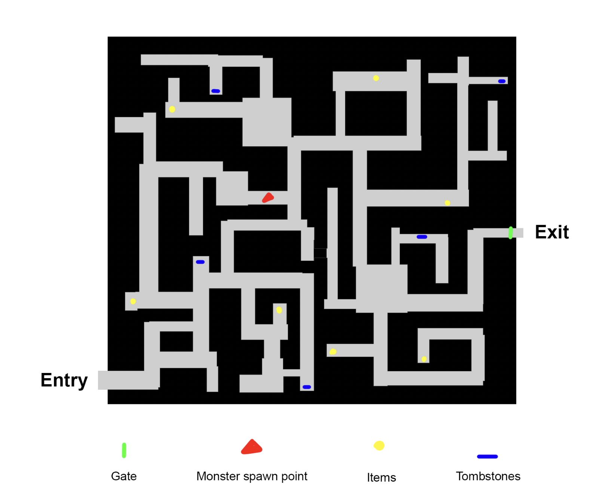

## Levels and World Design

### Game World 

The world seen by the player is a maze with an aesthetic style inspired by the Maze Runner. It is 3D and will be displayed on a single screen. Only one level will be available, however, the maze will be different each time so that the game can be replayed multiple times. The player starts on one side of the maze and will have to navigate through to the exit of the maze by exploring and avoiding ghosts. The exit will not be open until sunrise so the player will have to survive until it does. Hints may be available to the player if they find them in the maze, however, no map/minimap will be available as it would defeat the purpose of the maze. Hiding spots are also available for the player to avoid the ghost, however, if the player enters the spot whilst in the ghost’s vision range they will be found.

  

### Objects 

- Tombstones. Players can destroy tombstones or interact with them in some way to unlock lore. 
- Heirloom. Looks like an old knife/ weapon. 
- Flashlight. Starts in the player’s inventory. Player can turn it on or off.
- The player can collect other items such as weapons to slow down the monsters and prevent them from chasing the player. The player will be able to throw certain objects.

  

### Physics 

- Players will collide with the walls of the maze.
- Player will accelerate up to a certain speed when they sprint. 
- Items thrown by the player will collide with the walls of the maze and the ghost.
- Players will collide with tombstones.
- Players will be able to run through the ghost. 
- Walls can block projectiles thrown by the ghost.

